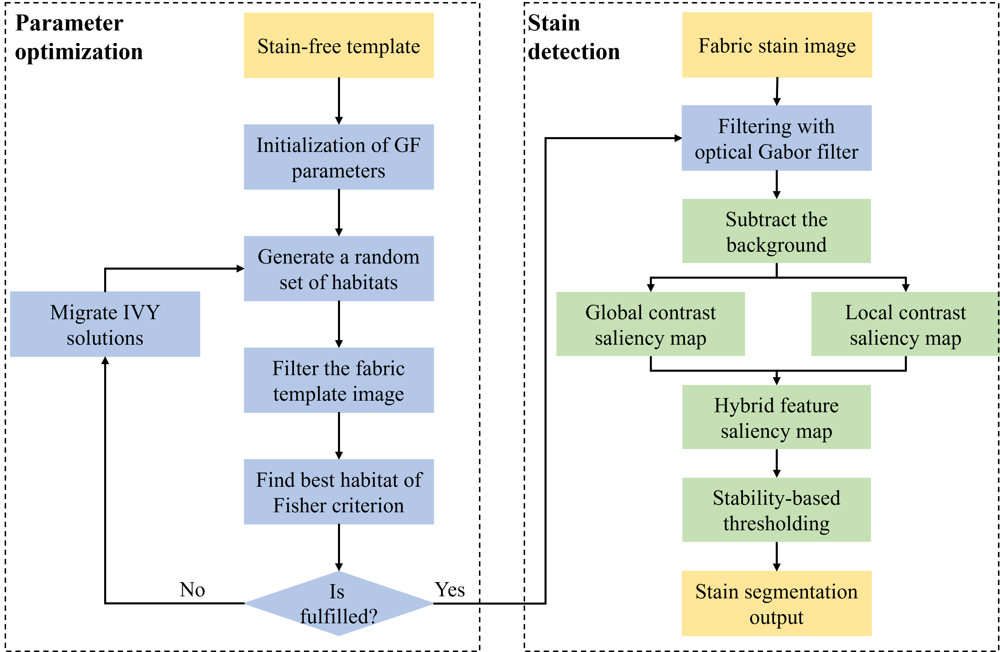

# Enhanced Fabric Stain Detection via Gabor-Optimized Saliency Fusion and Stability-Driven Thresholding

This repository corresponds to the manuscript:

> **"Enhanced Fabric Stain Detection via Gabor-Optimized Saliency Fusion and Stability-Driven Thresholding"**  
> Submitted to *The Visual Computer* (Springer)
  

GitHub Repository: [https://github.com/SwaggyPinqi12/HSSTalgorithm](https://github.com/SwaggyPinqi12/HSSTalgorithm)

---

## 📘 Repository Statement

This repository is established to accompany the above-mentioned manuscript.  
It provides environment setup instructions, partial illustrative examples, and experimental result summaries.  

Due to **data confidentiality agreements** with the collaborating textile factory, only a **limited subset of fabric images** is included for demonstration purposes.  
All other industrial samples and corresponding pixel-level annotations cannot be publicly disclosed.

> ⚠️ **Note:** The complete source code will be made publicly available **after the manuscript is formally accepted** for publication.

---

## 🧩 Overview

Fabric stain detection is crucial in the textile industry yet remains challenging due to **heterogeneous textures** and **low-contrast features**.  
This study introduces a **Gabor-optimized hybrid saliency and stability-driven thresholding framework** for robust automatic fabric stain detection.

### Key Contributions (illustrated in `assets/` folder):

- **Figure 1 – Framework Overview:**  
  The overall detection pipeline integrates Gabor-based texture enhancement, hybrid saliency fusion, and stability-driven thresholding.  
  

- **Figure 2 – IVY Optimization for Gabor Parameters:**  
  The IVY optimization algorithm efficiently determines optimal Gabor parameters tailored to diverse fabric textures, enhancing texture-aware feature extraction.  
  

- **Figure 3 – Hybrid Contrast Enhancement:**  
  Inspired by the human visual system’s sensitivity to contrast, the hybrid contrast mechanism combining global and local cues effectively highlights stain regions against complex backgrounds.  
  

- **Figure 4 – Stability-Driven Thresholding:**  
  A segmentation stability criterion ensures adaptive and robust stain region separation.  
  

---

## 📊 Experimental Results

### (1) Comparison with Traditional Visual Methods

  

| Metric level | Method | Precision /% | Recall /% | Accuracy /% | F1 /% |
|:-------------:|:--------|:-------------:|:----------:|:------------:|:------:|
| **Pixel-level** | GFC [13] | 56.73 | 75.68 | 98.9 | 50.52 |
|  | BAS-GSA [14] | 57.49 | 79.02 | 99.1 | 56.39 |
|  | MDBP [8] | 54.29 | 43.05 | 64.22 | 46.28 |
|  | **Ours** | **95.14** | **81.22** | **99.5** | **84.59** |
| **Image-level** | GFC [13] | 98.40 | 98.45 | 96.92 | 98.43 |
|  | BAS-GSA [14] | 98.41 | 99.34 | 97.78 | 98.87 |
|  | MDBP [8] | 98.09 | 62.36 | 61.95 | 76.25 |
|  | **Ours** | **99.77** | **99.94** | **99.78** | **99.86** |

*The proposed method achieves the best performance across all metrics at both pixel and image levels.*

---

### (2) Comparison with Deep Learning Models

  

| Metric level | Method | Precision /% | Recall /% | Accuracy /% | F1 /% |
|:-------------:|:--------|:-------------:|:----------:|:------------:|:------:|
| **Pixel-level** | Unet++ [22] | 76.88 | 71.82 | 99.36 | 69.11 |
|  | DeeplabV3 [23] | 83.39 | 79.59 | 99.40 | 78.01 |
|  | UperNet [24] | 82.08 | 81.33 | 99.44 | 78.68 |
|  | SegFormer [25] | 77.94 | 73.77 | 99.33 | 71.58 |
|  | **Ours** | **95.58** | **82.57** | **99.49** | **85.69** |
| **Image-level** | Unet++ [22] | **100.00** | 92.41 | 92.79 | 96.06 |
|  | DeeplabV3 [23] | 96.53 | 99.72 | 96.33 | 98.10 |
|  | UperNet [24] | 98.22 | 98.76 | 97.12 | 98.49 |
|  | SegFormer [25] | **100.00** | 93.79 | 94.10 | 96.80 |
|  | **Ours** | 99.45 | **99.86** | **99.48** | **99.72** |

*Compared to deep learning segmentation models, the proposed method demonstrates higher precision and balanced recall, indicating effective stain localization and reduced false positives.*

---

## ⚙️ Environment and Configuration

### 1. Proposed & Traditional Visual Methods
- **Platform:** Visual Studio 2022  
- **Language:** C++  
- **Library:** OpenCV 3.4.16  
- **Build Type:** Release (x64)  

**Setup Guide:**
1. Clone the repository  
   ```bash
   git clone https://github.com/SwaggyPinqi12/HSSTalgorithm.git
2. Open the Visual Studio solution file.
3. Configure OpenCV environment variables (include, lib, and bin paths).
4. Build the project in *Release* mode.
5. Executables and results will appear under /bin.

### 2. Deep Learning Baselines
- **Environment:** WSL2 (Ubuntu 22.04)
- **Python:** 3.10.16
- **CUDA:** 12.1 
- **PyTorch:** 2.1.2+cu121
- **segmentation-models-pytorch:** 0.5.1.dev0
- **Pillow:** 11.0.0

**Setup Guide:**
1. Clone the repository  
   ```bash
   git clone https://github.com/SwaggyPinqi12/HSSTalgorithm.git
2. Create virtual environment
   ```bash
    python3 -m venv venv
    source venv/bin/activate
3. Install dependencies
   ```bash
    pip install torch==2.1.2+cu121 torchvision --index-url https://download.pytorch.org/whl/cu121
    pip install segmentation-models-pytorch==0.5.1.dev0 pillow==11.0.0
---

## 📂 Repository Structure
    
    HSSTalgorithm/
    │
    ├── assets/                     # Figures used in README and manuscript
    ├── HSSTalgorithm/              # C++ implementation (to be released)
    ├── dl_baselines/               # Deep learning comparison scripts (to be released)
    ├── dataset_samples/            # Limited fabric samples for illustration
    ├── requirements.txt            # Python dependency list
    └── README.md                   # Current document
---

## Future Release Plan

The complete implementation, including:
- Source code for Gabor optimization, hybrid saliency fusion, and stability-driven thresholding,
- Training and inference scripts for Comparison deep-learning models,
- Evaluation and visualization scripts for pixel- and image-level performance.

will be publicly released on this repository after the manuscript is officially accepted by *The Visual Computer*.

Since the software version of this algorithm has already been deployed and tested in a third-party textile factory, the temporary postponement of full code release is to avoid unnecessary code exposure before formal publication.  
We appreciate your understanding and patience.

---

## Contact

For inquiries or collaboration, please contact:

**Author:** Pinqi Cheng  
**Email:** [cpq@zju.edu.cn](mailto:cpq@zju.edu.cn)

---
